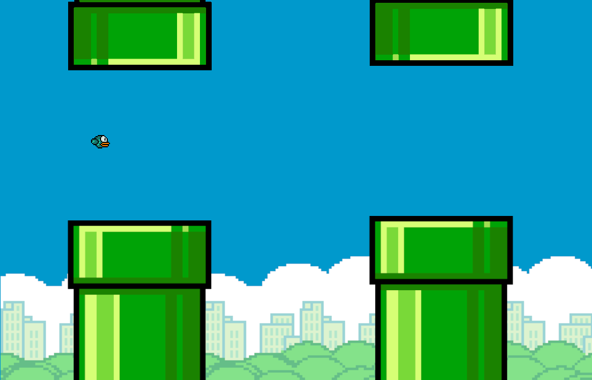
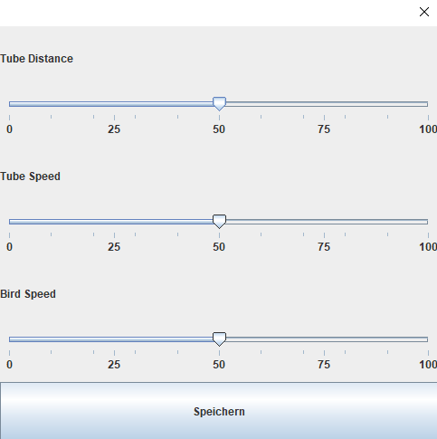

DHSH WINF - Grundlagen der Programmierung 2

# Projekt: FlappyBird mit java Swing

von Marvin und Martin

## Abstrakt das Konzept Flappy Bird
Entwicklung einer Anwendung, welche an das aus 2017 bekannte Videospiel "Flappy Bird" erinnert,
ein Vogel bewegt sich durch schnell auf ihn zu bewegene Hindernisse (Röhren) durch. Hierbei ist die herrausvorderung
als Spieler den Vogel durch lücken zwischen zwei Hindernisse, welche von oben und unten eine lücke erstellen, zu steuern. 
Eine Spielrunde endet im falle das der Vogel mit einer Röhre Kollidiert.

## Schwierigkeits einstellungen

Je nach persönlicher eignung und Fähigkeit der Spieler soll es für diese
möglich sein jeweils eine eigene Schwirigkeit festzulegen.
Hierbei haben drei größen in die Schwierigkeitseinstellung einfluss.
1. Die geschwindigkeit des Vogels
2. Die geschwindigkeit der Röhren
3. Der abstand der Rörhren

Pro durchflogene Röhre wird der Highscore um die gewählten schwierigkeitswerte erhöht

## Speichern und Laden

Das Speichern und Laden der Highscores geschieht im Hintergrund, so wird beim starten der Anwendung
die bisherigen Highscores geladen. Diese kann man sich Anschließend im Startmenü anschauen. Zudem wird nach beenden eines Spieldurchlaufes die eigene Plazierung 
unter allen bisherigen Highscores angezeigt.

## Bewegung
Nach dem Starte des Spiels ist es möglich, mithilfe der Leertaste sowie der "PfeilTaste nach oben" den Vogel auf der Y-Achse zu bewegen
 und diesen durch die einzelnen hindernisse zu manövrieren. Eine Bewegung auf der X-Achse ist hierbei nicht möglich und findet auch nicht statt.

## Client-Server-Modell
Nach beenden eines Spieldurchlaufes werden alle Highscores an einen Server gesendet. Dieser überprüft ob die gesendeten Highscores bereits in der highscoreliste des Servers
gespeichert sind, und speichert diese anschließend ab.
